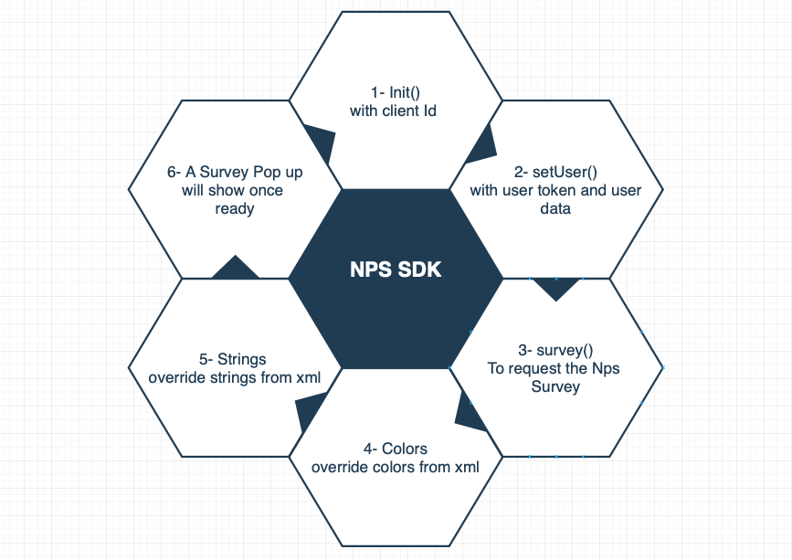

# Android-NPS-SDK

## Android nps rating library

### 1. Structure



### 2. Setup
* Add jitpack dependency to root build.gradle
    ```bash
        	allprojects {
        		repositories {
        			...
        			maven { url 'https://jitpack.io' }
        		}
        	}
     ```

 * Add the dependency
    ```bash
	    dependencies {
	        implementation 'com.github.UsePace:android-nps-sdk:{latest-version}'
	}
    ```

  * In case of Manifest Failure, Add this under Application Tag
    ```bash
     tools:replace="android:theme"
    ```

### 3. Sample App

  * For Debugging/Testing the library (to be able to run the library as an application) do the following:

  * Replace The `` build.gradle `` plugin from ``com.android.library`` to ``com.android.application``

  * Uncomment the Manifest ``todo: Uncomment for testing ``

  * Test and debug method inside ``TestActivity.Java``, Default Launcher for the app

### 4. Usage

#### 4.0 Design
 * For overriding nps strings add the following strings to strings.xml - strings-ar.xml

    ```bash
    <string name="nps_submit">Submit</string>
    <string name="nps_thank_you">Thank you 😊</string>
    <string name="nps_failed">Failed to submit result 🙁</string>
    ```
 * For colors styling override to colors.xml

     ```bash
    <color name="nps_colorPrimary">#3F51B5</color>
    <color name="nps_colorPrimaryDark">#303F9F</color>
    <color name="nps_colorAccent">#FF4081</color>
     ```

#### 4.1 init()

 * First Step for integrating the app is to init with the ```client_id``` at the start of the application

     ```bash
    Nps.init(Context context, ClientId: client_id)
     ```

#### 4.2 setUser()
 * Setting the user info

      ```bash
     Nps.setUser(String user_token, UserData: user_data)
      ```
 * UserData is a HashMap/Dictionary of a key/value pairs
 

#### 4.3 survey()
 * Requesting the NPS survey and display it if available & eligible
 * Sample code for calling survey
    ```bash
    Nps.survey(Language: language, SurveyCallbacks: survey_call_backs);
    ```
 * SurveyCallbacks is optional, null is allowed
 * Executing this interface will load the survey and display it in top of app
 * an error callback will be triggered in case of error
 * Available SurveyCallbacks:
 
   ```bash
    - void onFailedToLoadSurvey(NpsException npsException)
   ```